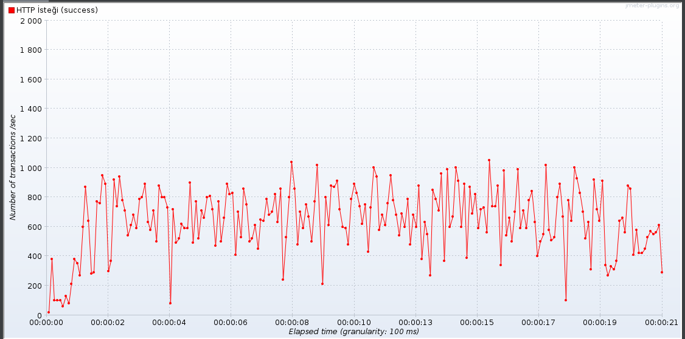
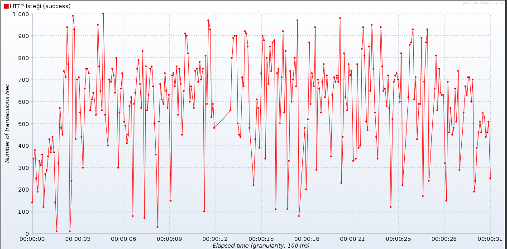
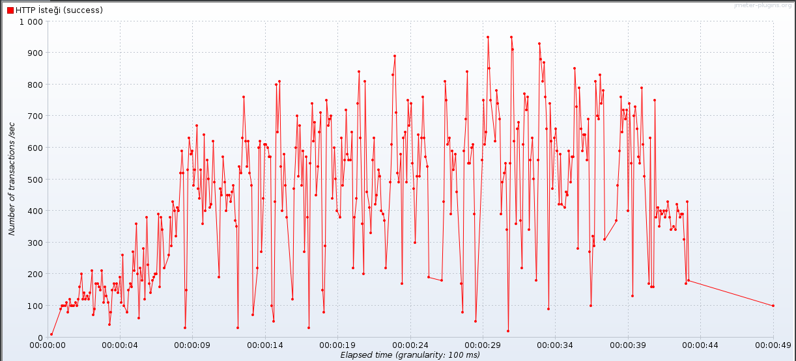
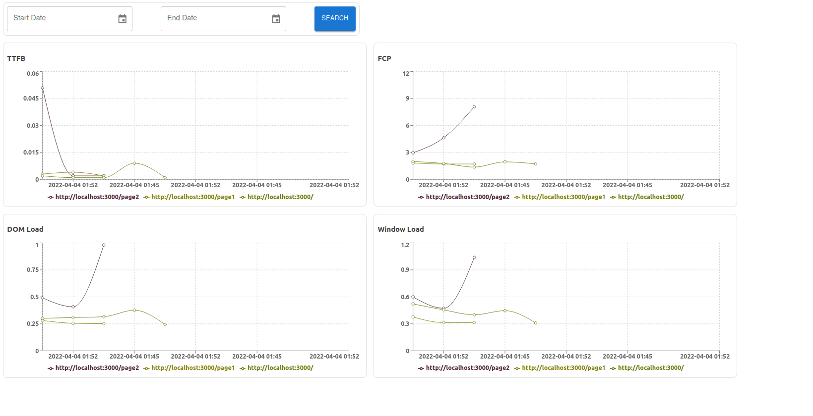

# Performance Analytics

Check web page loading performance with performance analytics!

***perf-analytics-js***
#

Using npm:

```bash
$ npm install @gurkanakdeniz/perf-analytics-js
```

Using unpkg CDN:

```html
<script src="https://unpkg.com/@gurkanakdeniz/perf-analytics-js@1.0.2/src/index.js"></script>

- or -

<script src="https://unpkg.com/@gurkanakdeniz/perf-analytics-js"></script>

<script>
  perfAnalyticsSetup("%PERF_API_URL%");
</script>
```

our api : [http://localhost:3000/analytic/data](http://localhost:3000/analytic/data/analytic/data) 

*test pages:*


*[http://localhost:3000](http://localhost:3000)* 

*[http://localhost:3000/page1](http://localhost:3000/page1)* 

*[http://localhost:3000/page2](http://localhost:3000/page2)*

#

***perf-analytics-api***


```bash
$ npm install 
$ npm start
```


[http://localhost:3001/](http://localhost:3001/) 

**rps benchmark results**

*i tried over 1000 but it didn't work at local pc*

 
 
 
 
 **dashboard data endpoint**
 
```bash
// last 30 minutes data
curl http://localhost:3000/analytic/dashboard

// with start and end date
curl http://localhost:3000/analytic/dashboard?startDate=2022-04-02T21:24:27.000Z&endDate=2022-04-04T21:24:32.000Z
```

 **data endpoint**
 
```bash
// last 30 minutes data
curl http://localhost:3000/analytic/data

// with start and end date
curl http://localhost:3000/analytic/data?startDate=2022-04-02T21:24:27.000Z&endDate=2022-04-04T21:24:32.000Z
```

*note: utc may be different*

 **data at mongo atlas**
 
```json
 {
  "_id": {
    "$oid": "624b33fe9ed0718fc3fd2699"
  },
  "endpoint": "http://localhost:3000",
  "ttfb": {
    "$numberDouble": "0.149"
  },
  "fcp": {
    "$numberDouble": "10.189"
  },
  "dom": {
    "$numberDouble": "1.293"
  },
  "window": {
    "$numberDouble": "1.337"
  },
  "ip": "11.11.11.12",
  "created_date": {
    "$date": {
      "$numberLong": "1649095678000"
    }
  },
  "__v": {
    "$numberInt": "0"
  }
}
``` 

#

***perf-analytics-dashboard***


```bash
$ npm install 
$ npm start
```

[http://localhost:3001](http://localhost:3001) 

 **preview**
 
 
  

## License

This project is licensed under the GNU General Public License v3.0 - see the [LICENSE](LICENSE) file for details

 